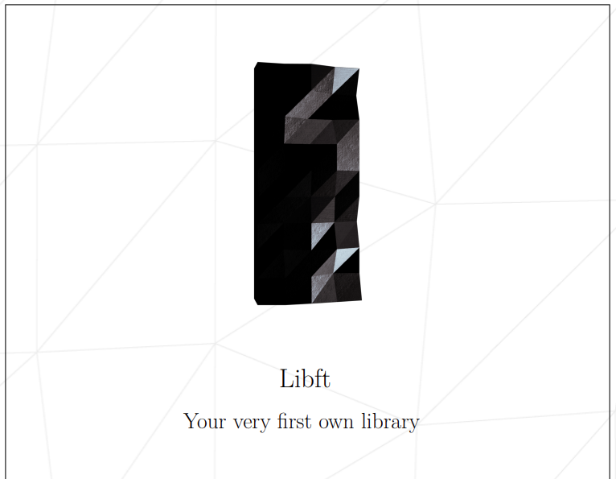
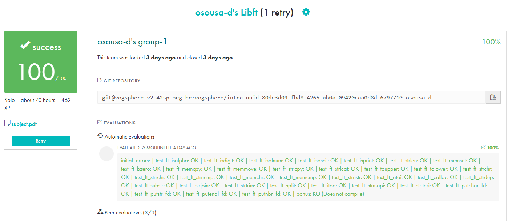

# Libft-42

A libft é uma biblioteca escrita em C como parte do currículo da 42 School. Ela reimplementa funções padrão da linguagem C, como strlen, strcpy, memset, entre outras, além de funções adicionais criadas pelo estudante. O objetivo do projeto é reforçar o entendimento da linguagem C, gerenciamento de memória e boas práticas de programação.

Inicio: 21/07/2025
Término: 08/08/2025

